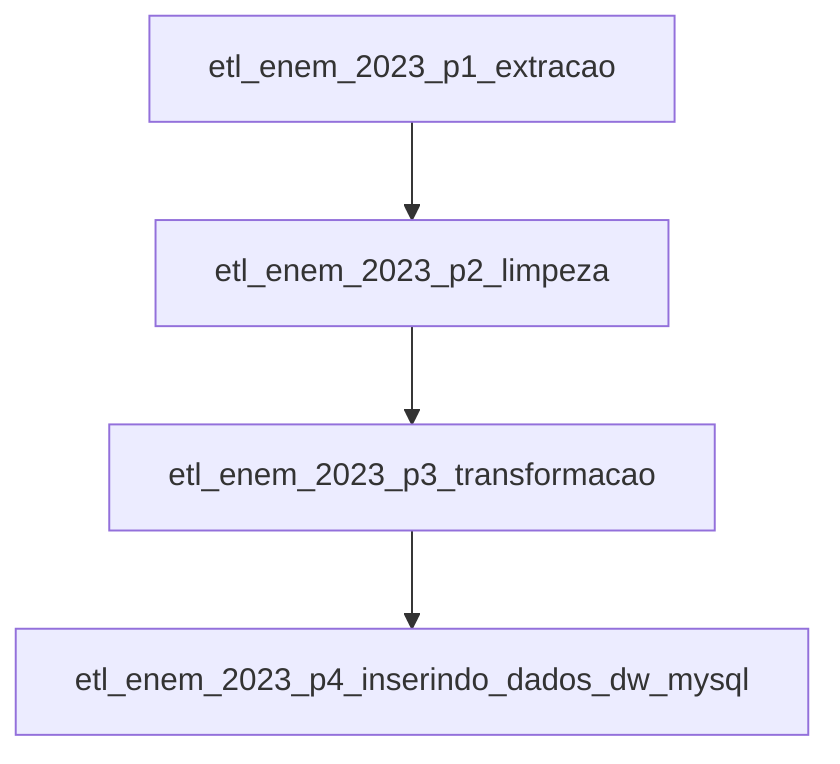

# etl-airflow-mysql-enem-2023

Este repositório é uma POC para representar um workflow de engenharia de dados utilizando **Apache Airflow, MySQL, Docker e Redis**. O objetivo é processar os dados do ENEM 2023 e carregá-los em um Data Warehouse para análise.

## 📌 Visão Geral

O workflow implementa um processo de **ETL (Extract, Transform, Load)** para coletar, limpar e carregar os dados do ENEM 2023 em um banco de dados MySQL. O **Airflow** gerencia a orquestração das tarefas, garantindo que as fases do pipeline sejam executadas na ordem correta.

## 📊 Fluxo de Trabalho

O fluxo de ETL está dividido em **4 DAGs principais**, que são executadas sequencialmente:

1. **`etl_enem_2023_p1_extracao`**  
   - Baixa os dados brutos do ENEM 2023 do site do INEP.
   - Armazena o arquivo `.csv` na pasta de staging dentro do ambiente do Airflow.

2. **`etl_enem_2023_p2_limpeza`**  
   - Processa e limpa os dados brutos.
   - Remove colunas desnecessárias e trata valores nulos.
   - Gera um novo `.csv` limpo e preparado para transformação.

3. **`etl_enem_2023_p3_transformacao`**  
   - Aplica regras de transformação.
   - Calcula estatísticas e novas colunas úteis.
   - Gera o arquivo final pronto para carga no DW.

4. **`etl_enem_2023_p4_inserindo_dados_dw_mysql`**  
   - Lê os dados processados e insere no MySQL.
   - Popula as tabelas dimensionais e a tabela fato com as notas dos candidatos.
   - Utiliza processamento em **chunks** para otimizar a inserção.

### 🔄 Fluxo entre as DAGs

Cada DAG depende da execução bem-sucedida da anterior, garantindo que os dados sejam processados corretamente antes de avançar para a próxima etapa.

## 📖 Documentação Completa

Para mais detalhes sobre a implementação e o código, acesse a documentação no Google Colab:

🔗 [Documentação no Colab](https://colab.research.google.com/drive/1jGYSlFpWaFJACmZloC6MrZduogTtaG3d?usp=sharing)

