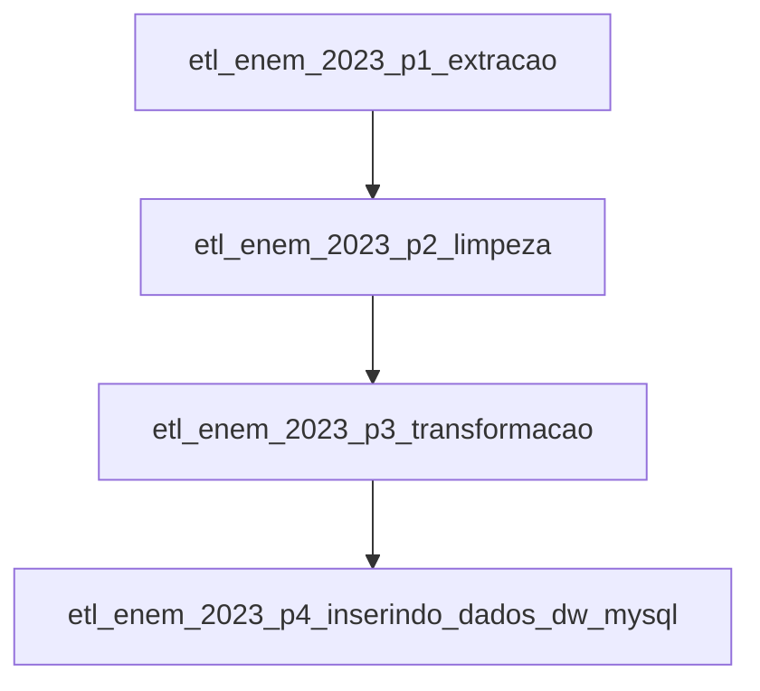

# etl-airflow-mysql-enem-2023

Este repositório é uma POC para representar um workflow de engenharia de dados utilizando **Apache Airflow, MySQL, Docker e Redis**. O objetivo é processar os dados do ENEM 2023 e carregá-los em um Data Warehouse para análise.

## Objetivo
Esse projeto visa realizar um processo completo de engenharia de dados, porém, com um pequeno escopo demonstrativo. Será utilizado a base de dados do enem 2023, que está acessível [gov.br](https://www.gov.br/inep/pt-br/acesso-a-informacao/dados-abertos/microdados/enem). O resultado do workflow irá gerar um dw que estará acessível via mysql. Com o resultado disponível, será criado um pequeno dashboard no intuito de tornar visível as **informações respostas** das **perguntas alvo**. Será utilizado o PowerBI para criar o dashboard.

### Perguntas alvo.
1. - **Qual a porcentagem de pessoas do sexo masculino e feminino realizaram o enem em 2023 por estado ?**
2. - **Quais foram as médias alcançadas pelos participantes do ENEM por disciplina  (como Matemática, Ciências da Natureza, Linguagens e Códigos, Redação, etc.) por estado ?**
2.1. **Qual o estado com média geral mais baixa e mais alta ?**
3. - **Qual o total de candidatos contabilizados ?" Quais são as tabelas fato e dimensão que devemos ter para responder essas questões ?**

## 📌 Visão Geral do workflow
O workflow implementa um processo de **ETL (Extract, Transform, Load)** para coletar, limpar e carregar os dados do ENEM 2023 em um banco de dados MySQL. O **Airflow** gerencia a orquestração das tarefas, garantindo que as fases do pipeline sejam executadas na ordem correta.

## 📌 Modelo do Data Warehouse

### Tabelas Dimensão

📂 Dimensão	**dim_estado**	**id_estado** (PK), **SG_UF_PROVA**

📂 Dimensão	**dim_candidato**	**id_candidato** (PK), **TP_FAIXA_ETARIA**, **TP_SEXO**

### Tabela Fato

📊 Fato	 **fato_notas**	**id_estado** (FK), **id_candidato** (FK), **NU_NOTA_MT**, **NU_NOTA_CN**, **NU_NOTA_LC**, **NU_NOTA_CH**, **NU_NOTA_REDACAO**

## 🏗️ Modelo relacional
                +------------------+
                |   dim_estado     |
                |------------------|
                | PK: id           |
                | SG_UF_PROVA      |
                +--------+---------+
                         | 1
                         | 
                         | N
                 +-------+---------+
                 |  fato_notas     |
                 |-----------------|
                 | PK: id          |
                 | FK: id_estado   |
                 | FK: id_candidato|
                 | NU_NOTA_MT      |
                 | NU_NOTA_CN      |
                 | NU_NOTA_LC      |
                 | NU_NOTA_CH      |
                 | NU_NOTA_REDACAO |
                 +-----------------+
                         ^
                         | 1
                         | 
                         | N
                +--------+---------+
                |   dim_candidato  |
                |------------------|
                | PK: id           |
                | TP_FAIXA_ETARIA  |
                | TP_SEXO          |
                +------------------+

## 🔀 Fluxo de Trabalho

O fluxo de ETL está dividido em **4 DAGs principais**, que são executadas sequencialmente:

1. **`etl_enem_2023_p1_extracao`**  
   - Baixa os dados brutos do ENEM 2023 do site do INEP.
   - Armazena o arquivo `.csv` na pasta de staging dentro do ambiente do Airflow.

2. **`etl_enem_2023_p2_limpeza`**  
   - Processa e limpa os dados brutos.
   - Remove colunas desnecessárias e trata valores nulos.
   - Gera um novo `.csv` limpo e preparado para transformação.

3. **`etl_enem_2023_p3_transformacao`**  
   - Aplica regras de transformação.
   - Calcula estatísticas e novas colunas úteis.
   - Gera o arquivo final pronto para carga no DW.

4. **`etl_enem_2023_p4_inserindo_dados_dw_mysql`**  
   - Lê os dados processados e insere no MySQL.
   - Popula as tabelas dimensionais e a tabela fato com as notas dos candidatos.
   - Utiliza processamento em **chunks** para otimizar a inserção.

### 🔁 Fluxo entre as DAGs

Cada DAG depende da execução bem-sucedida da anterior, garantindo que os dados sejam processados corretamente antes de avançar para a próxima etapa.

## 📖 Documentação Completa

Para mais detalhes sobre a implementação e o código, acesse a documentação no Google Colab:

🔗 [Documentação no Colab](https://colab.research.google.com/drive/1jGYSlFpWaFJACmZloC6MrZduogTtaG3d?usp=sharing)

