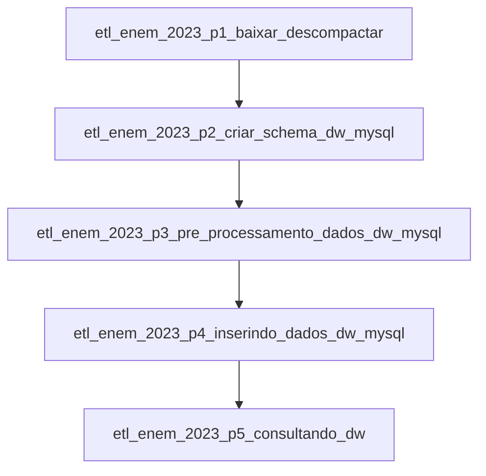

# etl-airflow-mysql-enem-2023

Este repositório é uma POC para representar um workflow de engenharia de dados utilizando **Apache Airflow, MySQL, Docker e Redis**. O objetivo é processar os dados do ENEM 2023 e carregá-los em um Data Warehouse para análise.

## Objetivo

Esse projeto visa realizar um processo completo de engenharia de dados, porém, com um pequeno escopo demonstrativo. Será utilizado a base de dados do enem 2023, que está acessível [gov.br](https://www.gov.br/inep/pt-br/acesso-a-informacao/dados-abertos/microdados/enem). O resultado do workflow irá gerar um dw que estará acessível via mysql. Com o resultado disponível, será criado um pequeno dashboard no intuito de tornar visível as **informações respostas** das **perguntas alvo**. Será utilizado o PowerBI para criar o dashboard.

### Perguntas alvo.

1. - **Qual a porcentagem de pessoas do sexo masculino e feminino realizaram o enem em 2023 por estado ?**

2. - **Quais foram as médias alcançadas pelos participantes do ENEM por disciplina(como Matemática, Ciências da Natureza, Linguagens e Códigos, Redação, etc.) por sexo em cada estado ?**

3. - **Qual a média geral entre homens e mulheres por estado ?**

4. - **Qual o estado com média geral mais baixa e mais alta ?**

5. - **Qual o total de candidatos contabilizados ?**

6. - **Qual a média geral ?**

## 📌 Visão Geral do workflow

O workflow implementa um processo de **ETL (Extract, Transform, Load)** para coletar, limpar e carregar os dados do ENEM 2023 em um banco de dados MySQL. O **Airflow** gerencia a orquestração das tarefas, garantindo que as fases do pipeline sejam executadas na ordem correta.

## 📌 Modelo do Data Warehouse

### Tabelas Dimensão

📂 Dimensão **dim_estado** **id_estado** (PK), **SG_UF_PROVA**

📂 Dimensão **dim_candidato** **id_candidato** (PK), **TP_FAIXA_ETARIA**, **TP_SEXO**

### Tabela Fato

📊 Fato **fato_notas** **id_estado** (FK), **id_candidato** (FK), **NU_NOTA_MT**, **NU_NOTA_CN**, **NU_NOTA_LC**, **NU_NOTA_CH**, **NU_NOTA_REDACAO**

## 🏗️ Modelo relacional

                +------------------+
                |   dim_estado     |
                |------------------|
                | PK: id           |
                | SG_UF_PROVA      |
                +--------+---------+
                         | 1
                         |
                         | N
                 +-------+---------+
                 |  fato_notas     |
                 |-----------------|
                 | PK: id          |
                 | FK: id_estado   |
                 | FK: id_candidato|
                 | NU_NOTA_MT      |
                 | NU_NOTA_CN      |
                 | NU_NOTA_LC      |
                 | NU_NOTA_CH      |
                 | NU_NOTA_REDACAO |
                 +-----------------+
                         ^
                         | 1
                         |
                         | N
                +--------+---------+
                |   dim_candidato  |
                |------------------|
                | PK: id           |
                | TP_FAIXA_ETARIA  |
                | TP_SEXO          |
                +------------------+

## 🔀 Fluxo de Trabalho

O fluxo de ETL está dividido em **4 DAGs principais**, que são executadas sequencialmente:

1. **`etl_enem_2023_p1_baixar_descompactar`**

   - Baixa os dados brutos do ENEM 2023 do site do INEP.
   - Armazena o arquivo `.csv` na pasta de staging dentro do ambiente do Airflow.

2. **`etl_enem_2023_p2_criar_schema_dw_mysql`**

   - Processa e limpa os dados brutos.
   - Remove colunas desnecessárias e trata valores nulos.
   - Gera um novo `.csv` limpo e preparado para transformação.

3. **`etl_enem_2023_p3_pre_processamento_dados_dw_mysql`**

   - Aplica regras de transformação.
   - Calcula estatísticas e novas colunas úteis.
   - Gera o arquivo final pronto para carga no DW.

4. **`etl_enem_2023_p4_inserindo_dados_dw_mysql`**
   - Lê os dados processados e insere no MySQL.
   - Popula as tabelas dimensionais e a tabela fato com as notas dos candidatos.
   - Utiliza processamento em **chunks** para otimizar a inserção.
5. **`etl_enem_2023_p5_consultando_dw`**
   - Realiza consultas para responder a perguntas alvo afim de testar a o dw recem gerado.

### 🔁 Fluxo entre as DAGs



Cada DAG depende da execução bem-sucedida da anterior, garantindo que os dados sejam processados corretamente antes de avançar para a próxima etapa.

## 🔥 **Visão Geral do Workflow**

O pipeline é composto por **6 DAGs** organizadas da seguinte forma:

| 🄍 DAG ID                                            | 🔥 Responsabilidade                              |
| --------------------------------------------------- | ------------------------------------------------ |
| `etl_enem_2023_p1_baixar_descompactar`              | Baixar e descompactar os microdados do ENEM 2023 |
| `etl_enem_2023_p2_criar_schema_dw_mysql`            | Criar bancos e tabelas no MySQL                  |
| `etl_enem_2023_p3_pre_processamento_dados_dw_mysql` | Carregar e limpa os dados do ENEM                |
| `etl_enem_2023_p4_inserindo_dados_dw_mysql`         | Inserir dados no Data Warehouse                  |
| `etl_enem_2023_p5_consultando_dw`                   | Consultar os dados e gerar insights / testar     |
| `workflow_dw_enem_2023`                             | DAG que representa o workflow completo.          |

---

## 🛠️ **Detalhamento das DAGs**

### **📈 1. DAG: `etl_enem_2023_p1_baixar_descompactar`**

**Objetivo:** Baixa os microdados do ENEM e descompacta o arquivo ZIP.

#### **🗒️ Funções**

```python
def salvar_arquivo(response, caminho_arquivo):
    """
    Salva o arquivo baixado no diretório especificado.
    """

def baixar_enem_2023():
    """
    Faz o download do arquivo ZIP com os dados do ENEM 2023.
    """

def descompacta_bd_enem():
    """
    Extrai os arquivos do ZIP baixado.
    """
```

### 🔹 **Ordem de execução**

baixar_enem_2023 → Baixa os dados

descompacta_bd_enem → Descompacta o arquivo

## 📈 **2. DAG: etl_enem_2023_p2_criar_schema_dw_mysql**

Objetivo: Cria os bancos e tabelas do Data Warehouse.

### 🗒️ **Função**

```python
def criar_schemas():
  """
  Cria bancos e tabelas no MySQL, resetando os dados a cada execução.
  """
```

### 🔹 **Criação das tabelas:**

staging_enem (dados brutos)

dim_estado (dimensão de estados)

dim_candidato (dimensão dos candidatos)

fato_notas (tabela de fatos com as notas)

### 🔹 **Ordem de execução**

tarefa_criar_bd_mysql → Criação do banco de dados e tabelas

## 📈 **3. DAG: etl_enem_2023_p3_pre_processamento_dados_dw_mysql**

Objetivo: Processa e limpa os dados do ENEM antes da inserção no DW.

### 🗒️ **Funções**

```python
def verificar_arquivo():
   """
   Verifica se o arquivo de entrada existe antes de iniciar o processamento.
   """

def carregar_pre_processar_dados():
   """
   Processa os dados, removendo colunas desnecessárias e tratando valores nulos.
   """
```

### 🔹 **Ordem de execução**

tarefa_verificar_arquivo_existe → Confere se o CSV existe

tarefa_pre_processamento → Processa e limpa os dados

## 📈 **4. DAG: etl_enem_2023_p4_inserindo_dados_dw_mysql**

Objetivo: Insere os dados processados no Data Warehouse.

### 🗒️ **Funções**

```python
def inserir_dim_estado(cursor, chunk):
  """
  Insere estados únicos na tabela dim_estado.
  """

def inserir_dim_candidato(cursor, chunk):
  """
  Insere candidatos únicos na tabela dim_candidato.
  """

def inserir_fato_notas(cursor, chunk):
  """
  Insere registros na tabela fato_notas.
  """

def inserir_dados_dw_mysql():
  """
  Lê o arquivo pre-processado e submete ao processo de persistência.
  """

```

### 🔹 **Ordem de execução**

tarefa_inserir_dados_mysql → Insere estados

## 📈 **5. DAG: etl_enem_2023_p5_consultando_dw**

Objetivo: Executa consultas no MySQL para testar o DW.

## 🔥 **Para rodar o projeto ?**

Levando com conta que o docker está instalado/configurado, siga os passos:

1. **`Baixe o projeto`**

   ```python
   git clone https://github.com/pbitalo/etl-airflow-mysql-enem-2023.git
   ```

2. **`Execute o docker-compose`**

   ```bash
   docker-compose up -d
   ```

3. **`acesse no navegador localhost:8080 e faça o login com airflow/airflow`**

4. **`Crie as seguintes variáveis de ambiente indo em Admin->Variables: `**

| Nome da Variável    | 🔥 Valor                                                         |
| ------------------- | ---------------------------------------------------------------- |
| `CHUNK_PROCESS_QTD` | 5                                                                |
| `CHUNK_SIZE`        | 5000                                                             |
| `url_enem_2023`     | https://download.inep.gov.br/microdados/microdados_enem_2023.zip |

4. **`Execute a DAG workflow-dw-enem-2023`**
